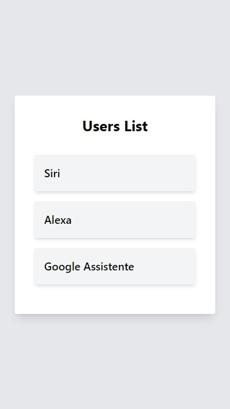

# Prática: Lista de Usuários

Neste projeto, as tarefas foram:

- criar uma nova aplicação React.js;
- criar um componente responsável por exibir as informações sobre usuários na aplicação (item);
- criar um componente responsável por listar os usuários como itens (list);
- exibir o componente list na página principal (o componente list deve receber a lista de usuários por meio desta página).

# Imagem do projeto final

## Contribuição

Contribuições são bem-vindas! Sinta-se à vontade para abrir uma issue ou enviar um pull request com melhorias para este projeto.
