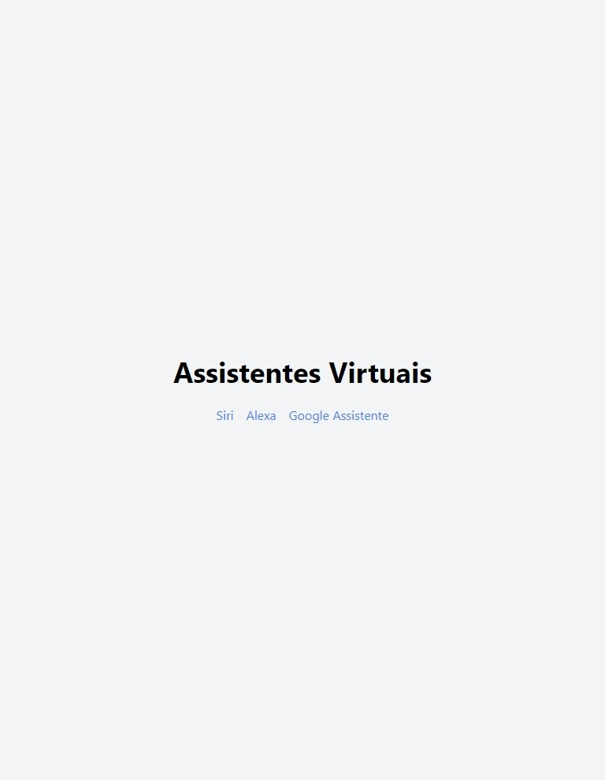

# Prática: Lista Assistentes Virtuais com Navegação

Neste projeto, as tarefas foram:

- Instalar o React Router DOM;
- Criar uma pasta pages dentro da pasta src;
- Criar 3 páginas dentro desta pasta pages:
- Home (página que irá conter uma lista de assistentes virtuais);
- Details (página que irá exibir os detalhes de cada assistente virtual da lista);
- Error (página que será exibida quando o endereço informado na URL for inválido);
- Implementar o componente Router, responsável pelo roteamento;

Ao acessar a aplicação:

- Na página Home, deve-se exibir a lista;
- Ao clicar no item da lista, o usuário deve ser redirecionado para a página que contém os detalhes da assistente virtual;
- A página Details deve exibir o nome, a descrição e uma imagem do item;
- Deve ser possível retornar à página Home;
- Ao acessar uma URL inexistente, deve ser exibida a página Error, com a mensagem "Página não encontrada" e uma opção para voltar à página Home.

# Imagem do projeto final

## Contribuição

Contribuições são bem-vindas! Sinta-se à vontade para abrir uma issue ou enviar um pull request com melhorias para este projeto.
